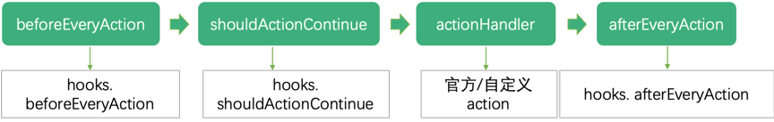

# leorc.js

**以下用 leorc 作为你指定的 rc 文件名**

`leorc.js` 位于每个项目的根目录下，用于单个项目与脚手架建立联系。

## 完整示例

```js
module.exports = {
  cmd: {
    hooks: {
      beforeEveryAction: (cli, commandName, args) => {
      }
      /*
       * 如果返回 false 则会拦截后续行为，完全自己代理
       */
      shouldActionContinue: (cli, commandName, args) => {
      }
      afterEveryAction: (commandName, args) => {
      }
    }
  },

  testAction: (options) => {},
  lintAction: (options) => {},
  isPrePublishParallel: false, // 发布之前test，lint，build是否要并行
  builder: {
    name: 'xxx-builder',
    version: '0.0.1',
    hooks: {
      beforeDev: (Builder) => {},
      afterDev: (Builder) => {},

      beforeBuild: (Builder) => {},
      afterBuild: (Builder) => {},
    }
  },
  publisher: {
    name: 'test-publisher',
    version: '0.0.1',
    hooks: {
      beforePublish: (Publisher) => {},
      afterPublish: (Publisher) => {},
    }
  }
}

```

## 字段解释

### cmd

扩展自定义命令并提供了钩子函数。运行时间如下：



#### cmd.beforeEveryAction

命令执行动作 action 之前。

#### cmd.shouldActionContinue

命令执行`hooks.beforeEveryAction`之后，执行命令动作 action 之前。若`shouldActionContinue`返回`false`，则会拦截后续行为，完全自己代理。

#### cmd.afterEveryAction

执行命令动作 action 之后。

### testAction

用于不同业务需求的测试点不同，leo 没有做统一的测试，而是通过项目模板针对业务需求自行提供测试内容

```typescript
type testAction = () => Promise<boolean>;
```

**必须返回 `boolean` 用来为 leo 判断是否通过测试**

### lintAction

用于不同团队的 lint 习惯不同，leo 没有做统一的 lint 校验，而是通过模板提供 lint 检测

```typescript
type lintAction = () => Promise<boolean>;
```

**必须返回 `boolean` 用来为 leo 判断是否通过 lint**

### isPrePublishParallel

在 `publish` 指令执行时，是否并行执行 `lint`，`test`，`build` 操作

默认：false

### builder

builder 用来声明模板的构建工具

builder 可以根据自身业务需求自行开发，[开发规范](http://doc.jd.com/feb-book/leo/advance/builder.html)

#### builder.name

构建器名称

#### builder.version

构建器版本

#### builder.options

构建器可自定义更改的配置项，具体配置需查看相应构建器文档

#### builder.hooks.beforeDev

生命周期：执行 dev 操作前

#### builder.hooks.afterDev

生命周期：执行 dev 操作后

#### builder.hooks.beforeBuild

生命周期：执行 build 操作前

#### builder.hooks.afterBuild

生命周期：执行 build 操作后

### publisher

#### publisher.options

发布器可自定义更改的配置项，具体配置需查看相应构建器文档

- [npm](https://coding.jd.com/leo-publishers/npm-publisher/)
- [ihub](https://coding.jd.com/leo-publishers/ihub-publisher/)
- [pubfree](https://coding.jd.com/leo-publishers/pubfree-publisher/)

#### publisher.hooks.beforePublish

生命周期：执行发布操作前

#### publisher.hooks.afterPublish

生命周期：执行发布操作后
